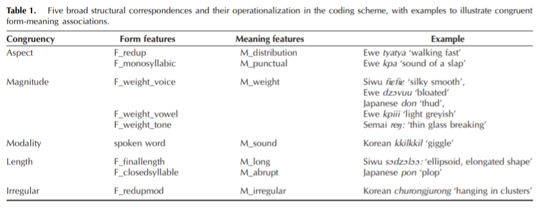

Okay this was actually published in September last year but I had a baby in July so that's just how long it's taken for me to find the time to write about this.

<!--more-->

You can find and cite the paper here:

> Punselie, S., McLean, B., & Dingemanse, M. (2024). [The Anatomy of Iconicity: Cumulative Structural Analogies Underlie Objective and Subjective Measures of Iconicity](https://doi.org/10.1162/opmi_a_00162). *Open Mind*, 8, 1191-1212.

This was part of a really wonderful BA project by Stella Punselie, supervised by Mark Dingemanse, which I was lucky to be invited to collaborate on just for the final bits. The figure below (Figure 2 from the paper) shows the general idea. We combine three different measures of iconicity: two behavioural (iconicity ratings and guessing accuracies, panels B and C) and one qualitative (Stella and Mark's analyses of structured iconic mappings in the stimuli, panel A). The stimuli in question for this study were ideophones from five languages representing four language families: Japanese (Japonic), Ewe (Kwa, Niger-Congo), Korean (Koreanic), Semai (Aslian, Austroasiatic) and Siwu (Na-Togo, Niger-Congo). 

 **Figure 2. Overview of the triangulation method. Structure mapping grounds the notion of iconicity, ratings capture subjective form-meaning
fit, and guessability provides a baseline of guessing accuracy. For instance, Korean tuˈgɯndugɯn ‘heartbeat’ features at least three levels of
iconic form-meaning correspondences (A). This predicts it should be rated as highly iconic (B) and should be more guessable than words with
fewer detected correspondences (C). Consistent with this, it was rated 4.8 for subjective iconicity and guessed at 80% accuracy. Arrows indi-
cate how measures predict (black) and inform (grey) each other.**

Rating tasks and guessing experiments are pretty well established methods for putting a numeric value on iconicity, but the analytical framework developed in this paper for qualifying the iconicity of ideophones is novel. The table below, table 1 from the paper, shows how it works:

There are 9 form features, which map to 7 semantic features (there are more formal than semantic features because three of the formal features relating to consonant, vowel, and tone weighting map to a single semantic feature for magnitude). Ideophones are coded first for their formal features, and then separately for their semantic features. When the formal and semantic features align as shown in the table, we consider this an instance of iconicity. I really love this method of analysing the iconicity of ideophones for the following reasons:

1. It is very explicit about *how* exactly the ideophones are iconic, and these mappings can be set up *before* actually looking at the data. One (very valid) criticism that has plagued the field of iconicity is that it's very easy, after the fact, to come up with ways in which a particular form-meaning mapping could be construed as iconic. 